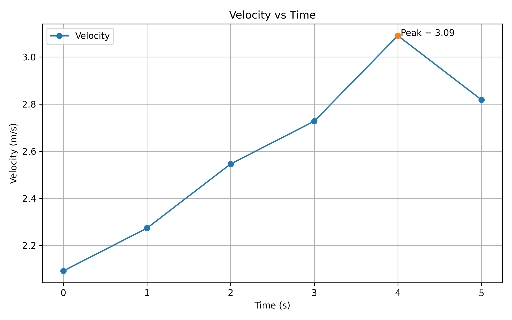

# Engineering Python Projects

This repository documents my transition from civil engineering into computational and AI-related fields.

I aim to apply programming and data-driven approaches to solve real-world engineering problems.

---

## Open Channel Flow Velocity Calculator

A simple engineering computation tool based on the Manning Equation.

This script allows users to estimate open channel flow velocity by providing hydraulic radius, channel slope, and Manning roughness coefficient.

### Key Features
- Engineering-based computation logic
- Input validation and error handling
- Beginner-friendly Python implementation
- Demonstrates integration of civil engineering knowledge with programming

---

More engineering tools and data-related projects will be added progressively as part of my learning journey.

## Example Output

